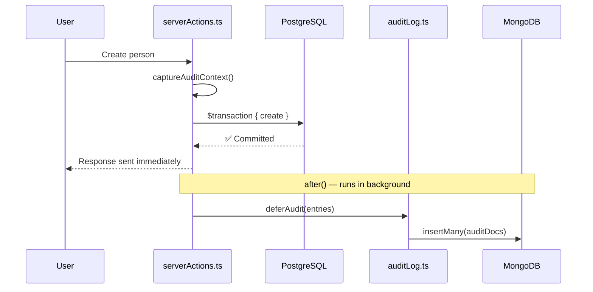
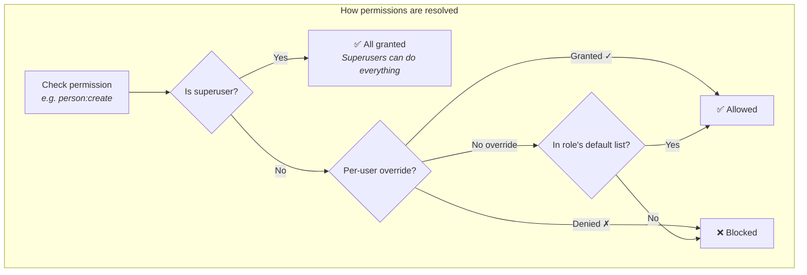
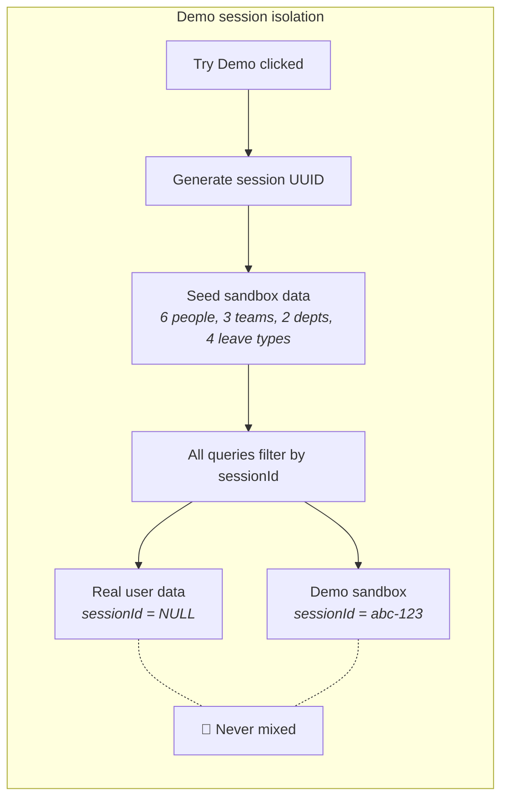
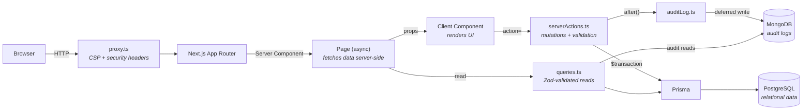

# HRManager

A full-stack HR management system built to production standards — not as a toy project, but as a showcase of real architectural decisions. Every technical choice has a reason. This README explains them.

[](https://github.com/MikkoNumminen/HRManager/actions/workflows/ci.yml)


### **[Try the live demo](https://hr-manager-pearl.vercel.app)** — click "Try Demo" to sign in instantly with your own isolated data sandbox, no account required.

<p align="center">
  
</p>
<p align="center">
  
  
</p>

---

## Highlights

### 🗄️ Data & persistence

- **Two databases, one app (polyglot persistence)** — PostgreSQL handles structured data (people, teams, permissions) because relational data needs ACID transactions and JOINs. MongoDB handles audit logs because they're append-only, variable-shape, and never updated — a document store is a natural fit. _Using one database for everything works, but choosing the right database for each workload is what production systems do._

- **Nothing is ever truly deleted (soft deletes)** — Records get a `deletedAt` timestamp instead of being removed. Partial unique indexes (`WHERE deletedAt IS NULL`) enforce uniqueness only on active records, so a deleted "John Smith" doesn't block creating a new one. Deleting a person cascades to their team memberships and nulls manager references. _Why? In HR systems, you need to answer "who was on this team last quarter?" years later. Hard deletes destroy that history._

- **Every change is recorded forever (immutable audit trail)** — Every mutation logs a before/after JSON snapshot to MongoDB. Writes are deferred via Next.js `after()` — the user gets their response immediately, logging happens in the background. Permission denials and rate limit hits are also logged as security events. A MongoDB TTL index on `createdAt` automatically purges documents older than 90 days — no cron job or manual cleanup needed. _Why? Compliance requires a full history of who changed what, when, and why — and it shouldn't slow down the user to record it._



### 🔐 Security & access control

- **34 permissions, not just 4 roles (granular RBAC)** — Instead of "admin = can do everything," each action has its own permission key (`person:create`, `team:delete`, `review:manage`, `leave:approve`, `position:manage`). Any permission can be overridden per-user: grant a regular user `person:create` without promoting them, or deny `team:delete` from an administrator who shouldn't have it. _Why? Simple role checks seem fine until you need exceptions — and every real organization has them._



- **Rate limiting without Redis** — A sliding-window algorithm built on PostgreSQL (30 req/min for actions, 10 req/min for auth). Uses atomic `INSERT...ON CONFLICT` so two simultaneous requests can't both sneak past the limit. A `/api/cron/cleanup` endpoint (protected by `CRON_SECRET`) prunes expired rate limit rows on a schedule — keeping the table from growing unbounded. _Why PostgreSQL instead of Redis? One fewer service to deploy, monitor, and pay for. The database you already have is powerful enough._

- **Security headers on every response (CSP)** — Each request gets a unique random nonce. Only scripts and styles tagged with that nonce can execute — even if an attacker injects HTML, the browser blocks it because the injected code doesn't have the secret nonce. Plus X-Frame-Options, X-Content-Type-Options, Referrer-Policy, and Permissions-Policy. _Why nonces? They're harder to bypass than domain allowlists and protect against inline script injection._

- **Demo users can't see real data (session isolation)** — Each "Try Demo" creates a private sandbox with a UUID. All database tables have a `sessionId` column — queries filter by it, so demo data and real data never mix. Sessions auto-expire after 24 hours. _This is a multi-tenancy pattern: hard data isolation without separate databases._



### ✨ User experience

- **Dashboard analytics** — KPI cards, bar charts, pie charts, line charts, and activity feed via MUI X Charts. Backed by 5 parallel PostgreSQL queries using CTEs and window functions — advanced SQL that computes complex aggregations in the database instead of fetching raw rows and looping in JavaScript. _Why raw SQL instead of the ORM? Prisma can't express CTEs or window functions, and these queries run much faster than the equivalent N+1 ORM approach._

- **Instant feedback (optimistic updates)** — When you create a person, they appear in the table immediately — before the server responds. React 19's `useOptimistic` shows the new item instantly, then reconciles when the server confirms. _Why? On slow connections, waiting 500ms+ for a table update feels broken. Optimistic UI makes the app feel instant._

- **Mobile-first responsive design** — Card layouts on mobile, tables on desktop, collapsible filters, stacking form buttons, hamburger navigation. All responsive tokens centralized in `muiStyles.ts`. _Why mobile-first? Building for small screens first ensures mobile never gets a degraded experience — you enhance for desktop, not patch for mobile._

- **6 visual themes** — Dark, Light, Cyberpunk, Retro Terminal, Bubblegum, and Ocean. CSS variables injected before the page renders (prevents the flash of wrong theme on load). Switching is instant with zero re-renders. _A small feature, but FOUC prevention and zero-rerender switching demonstrate attention to polish._

- **18 languages** — next-intl with cookie persistence and Accept-Language auto-detection. An AI translation pipeline audits 17 locale files and auto-translates missing keys via Claude API. _Why AI-powered? Manual translation doesn't scale. This pipeline translates 17 locales in ~80 seconds._

- **Gamified demo tour** — 8-step interactive tutorial with spotlight overlays, confetti, and auto-detection of task completion. Navigation hints are DOM-aware — they find the right element dynamically, so UI refactors don't break the tour.

- **Snackbar notifications** — Global success/error toasts via React context across all 17 form actions. No silent failures, no mystery about what happened.

- **Accessibility (WCAG)** — Semantic landmarks, skip-to-content, ARIA labels, `role="alert"` on errors (screen readers announce immediately), keyboard-navigable tables, and info tooltips with `cursor: "help"`. _Built into every component from the start, not bolted on afterward._

- **Loading skeletons on every page (Suspense boundaries)** — Every route has a `loading.tsx` that renders a pixel-matched MUI Skeleton layout while the async server component fetches data. Next.js automatically wraps these in `<Suspense>` — the shell is streamed instantly and the real content replaces it once ready. _Why skeletons instead of spinners? Spinners tell you "loading"; skeletons show you where the content will land, reducing perceived latency._

- **Server-side pagination & search** — Every management table (persons, teams, departments) uses database-level `skip`/`take` (Prisma) so only one page of results loads at a time. Search is URL-driven (`?q=` + `?page=`) via a 400ms debounced `router.replace` — typing updates local state immediately, the server re-fetches after the debounce. Results are bookmarkable and shareable. _Why server-side? Client-side filtering doesn't scale; pushing skip/take into Prisma means 25 rows per page regardless of org size, and the URL approach means deep links and browser history work naturally._

- **Polished empty states** — Tables show a contextual icon, heading, and hint when empty. Persons shows a people icon with "Add your first person using the form above"; teams and departments follow the same pattern. Hint text is shown only when the user has create permission. Translated across all 18 locales.

### 📦 Data operations

- **CSV import/export** — Drag-and-drop CSV upload with client-side validation preview and RFC 4180 parsing (the official CSV standard). Export persons, teams, departments, and audit logs. Custom CSV parser with zero external dependencies. _Why no library? Full control over error handling, smaller bundle, and no third-party code in the data pipeline._

### 📋 Performance Reviews / 360 Feedback

- **Full 360-degree review system** — SELF, MANAGER, PEER, and DIRECT*REPORT review types. Configurable question templates with RATING (slider 1–10) and TEXT (free text) question types. Review cycles follow a DRAFT → OPEN → CLOSED lifecycle. \_Why a lifecycle? Drafts let HR build cycles before employees see them; closing locks in responses for archival accuracy.*

- **Configurable templates and cycles** — Administrators create reusable `ReviewTemplate` models, attach questions, then instantiate `ReviewCycle` runs that target specific employees. `ReviewRequest` tracks who owes whom a review; `ReviewSubmission` stores the answers. Four new Prisma models, 11 server actions, 3 permission keys (`review:view`, `review:manage`, `review:submit`), and 6 dedicated routes (`/reviews`, `/reviews/templates`, `/reviews/cycles/[id]`, `/reviews/my-reviews`, etc.). Full audit logging and demo session isolation applied throughout.

### 🏖️ Leave / Absence Management

- **Complete leave lifecycle** — Leave types (Annual, Sick, Parental, Unpaid — fully configurable), leave requests with approval workflow, and per-person balance tracking. Three new Prisma models (`LeaveType`, `LeaveRequest`, `LeaveBalance`), 7 server actions, 4 permission keys (`leave:view`, `leave:request`, `leave:approve`, `leave:manage_types`). _Why a full workflow? Real HR systems don't just track time off — they enforce balances, prevent overlapping requests, and require manager approval._

- **Balance enforcement and overlap detection** — Creating a leave request checks the employee's remaining balance and rejects if insufficient. Overlapping date ranges (pending or approved) are blocked at the transaction level. Approving a request automatically decrements the balance via upsert. _Why transactional? Two managers approving the same request simultaneously could double-debit the balance without transaction isolation._

- **Three-tab UI** — Requests (with status filtering, approve/reject/cancel actions), Types (CRUD with color picker), and Balances (allocation with remaining calculation and color-coded indicators). Permission-gated controls: only users with `leave:approve` see the approve/reject buttons; only `leave:manage_types` can configure types and allocate balances.

### 📁 Position Catalog

- **Standardized job title catalog** — A dedicated `Position` model stores the organization's official position names. Administrators manage the catalog via `/positions` (add/delete entries). When HR updates a person's position field, the name is automatically synced into the catalog via an in-transaction `findFirst`+`create` — keeping it current without manual maintenance. The `UpdatePosition` form uses a `freeSolo` MUI Autocomplete: pick from the catalog or type anything. One new Prisma model, 2 server actions, 1 permission key (`position:manage`).

### 🧪 Quality

- **1498 tests, 99.9% line coverage** — Unit tests, integration tests against real PostgreSQL + in-memory MongoDB (no database mocks), and 75 Playwright E2E tests covering full user flows. _Why real databases in tests? Mocked tests can pass while production breaks. If your test doesn't hit a real database, it's not testing what you think it's testing._

- **Docker-ready** — `docker compose up` starts PostgreSQL + MongoDB + the app. Migrations run automatically, demo login works out of the box. _One command, zero setup, fully working._

---

## Tech stack

| Layer      | Technology                       | Why this choice                                                   |
| ---------- | -------------------------------- | ----------------------------------------------------------------- |
| Framework  | Next.js 16 (App Router)          | Server Components for zero-waterfall data fetching                |
| UI         | React 19 + MUI v7 + MUI X Charts | `useOptimistic` + `useActionState` eliminate form boilerplate     |
| Language   | TypeScript 5.9                   | End-to-end type safety from database schema to UI props           |
| ORM        | Prisma 7                         | Type-safe queries + raw SQL escape hatch for complex analytics    |
| Databases  | PostgreSQL + MongoDB 8           | Relational data in SQL, append-only logs in a document store      |
| Validation | Zod 4                            | Runtime validation + TypeScript type inference from one schema    |
| Auth       | NextAuth v5 (JWT)                | Stateless auth that scales without session storage                |
| Testing    | Jest 30 + Playwright             | Unit/integration against real DBs + E2E against production builds |
| CI/CD      | GitHub Actions                   | Lint, format, i18n audit, test, build — on every push             |

---

## Architecture

> Full diagrams (data model, request flow, RBAC resolution, server action lifecycle, auth flow) in [`docs/architecture.md`](docs/architecture.md).



**How data flows through the app:**

| What           | Where                   | How it works                                                                                               |
| -------------- | ----------------------- | ---------------------------------------------------------------------------------------------------------- |
| Reads          | `queries.ts`            | Zod-validated, no `"use server"`. Dashboard uses raw SQL with CTEs for complex aggregations                |
| Mutations      | `serverActions.ts`      | Always inside `$transaction` — even single operations, because consistency beats micro-optimization        |
| Audit logging  | `auditLog.ts` → MongoDB | Deferred via `after()` so it never slows down the user's response                                          |
| Types          | `schemas.ts`            | Zod schemas → `z.infer` → TypeScript types. One source of truth, used everywhere                           |
| Auth           | `auth.ts`               | JWT with permission-enriched tokens. `permissionsVersion` detects stale permissions without extra DB calls |
| RBAC           | `permissions.ts`        | Resolution order: superuser (all) → user override → role default                                           |
| Demo isolation | `demoSession.ts`        | `sessionId` column on all entities — `NULL` = real user, UUID = demo sandbox                               |
| Forms          | React 19                | `useActionState` with `action=` prop (no `onSubmit`); `useOptimistic` for instant create feedback          |
| Responsive     | `muiStyles.ts`          | Centralized tokens for breakpoints, spacing, typography — one file, all components                         |
| Themes         | `themeConfig.ts`        | CSS custom properties injected before hydration; 6 palettes switchable at runtime                          |
| i18n           | `messages/*.json`       | 18 locale files synced via AI translation pipeline                                                         |
| CSV            | `csvUtils.ts`           | RFC 4180 parser/generator with zero dependencies; permission-gated admin page                              |

---

## RBAC

| Role          | Access                           | Typical use case                                  |
| ------------- | -------------------------------- | ------------------------------------------------- |
| Superuser     | All 34 permissions (immutable)   | System admin — first OAuth user is auto-promoted  |
| Administrator | All CRUD + dashboard + audit log | Day-to-day management (no admin UI or data reset) |
| User          | Read-only                        | Regular employee viewing org data                 |
| Guest         | Read-only (unauthenticated)      | Public visitors browsing without login            |

**The key insight:** roles define defaults, but individual permissions can be overridden per-user. Want to give a User `person:create` without making them admin? Grant it. Want to block an Administrator from deleting teams? Deny it. Overrides always win — deny takes precedence over grant.

---

## Testing

| Layer            | Tests    | What it covers                                                                                            |
| ---------------- | -------- | --------------------------------------------------------------------------------------------------------- |
| UI components    | 734      | All 52 components: charts, forms, permission toggles, mobile views, themes, skeletons, search, leave mgmt |
| Server actions   | 253      | Every mutation: happy path, errors, permission denials, cascades, leave approval workflow                 |
| Zod schemas      | 94       | Validation rules, edge cases, type inference                                                              |
| Prisma queries   | 83       | Real PostgreSQL + MongoDB queries — not mocks; includes paged query tests for persons/teams/departments   |
| CSV utils        | 39       | RFC 4180 parsing, import validation, export formatting                                                    |
| Style tokens     | 37       | Responsive breakpoints, theme tokens, component styles                                                    |
| Auth callbacks   | 32       | JWT enrichment, permission freshness, superuser bootstrap                                                 |
| RBAC logic       | 28       | Resolution, overrides, deny-wins, superuser bypass                                                        |
| Tutorial config  | 26       | Tour steps, DOM selectors, completion detection                                                           |
| CSP proxy        | 20       | Nonce generation, header injection, domain allowlists                                                     |
| Rate limiting    | 18       | Sliding window, race conditions, cleanup                                                                  |
| i18n             | 14       | Locale loading, cookie persistence, Accept-Language detection                                             |
| Demo session     | 12       | Sandbox creation, isolation, cleanup, expiry                                                              |
| Theme config     | 12       | All 6 themes, CSS variables, FOUC prevention                                                              |
| Audit logging    | 11       | Deferred writes, before/after snapshots, security events                                                  |
| Auth route       | 5        | Rate limiting on auth endpoints, CSRF, GET passthrough                                                    |
| E2E (Playwright) | 75       | Auth, CRUD, detail editing, dashboard, profile, data I/O, form validation, full workflow                  |
| **Total**        | **1491** | **97.8% line coverage · 95.4% function coverage**                                                         |

```
Statements : 97.58%    Branches : 92.90%
Functions  : 95.40%    Lines    : 97.81%
```

**Testing philosophy:** Server-side tests run against **real PostgreSQL** and **in-memory MongoDB** — not mocks. If your test doesn't touch the real database, it's not catching the bugs that matter (wrong SQL, missing indexes, constraint violations). Client-side tests cover all 48 UI components. Playwright E2E tests run against a production build.

---

## Developer tooling

```bash
npm run test:e2e        # Playwright E2E tests (builds & starts production server)
npm run test:e2e:ui     # Playwright interactive UI mode
npm run validate        # pre-commit gate: Prettier + ESLint + i18n audit + full test suite
npm run i18n:audit      # report missing, extra, and untranslated keys across all locales
npm run i18n:fix        # auto-fill missing keys with English fallback, remove extras
npm run i18n:translate  # auto-translate via Claude Haiku API (requires ANTHROPIC_API_KEY)
```

---

## Autonomous agents

| Agent                | Trigger                     | What it does                                                                                    |
| -------------------- | --------------------------- | ----------------------------------------------------------------------------------------------- |
| **i18n translation** | `npm run i18n:translate`    | Audits 17 locale files against `en.json`, translates missing keys via Claude API                |
| **CI auto-fix**      | CI failure (`workflow_run`) | Triages failures, gathers sanitized logs, classifies error type, applies targeted fix, opens PR |

The **i18n translation agent** audits all locale files, identifies missing keys, and auto-translates via Claude API. Two modes: parallel agents during development (17 locales in ~80s) or headless API for CI.

The **CI auto-fix agent** (optional — requires paid API credits) runs a 6-stage pipeline on CI failures: transient detection → concurrent run guard → context gathering (sanitized logs + diff) → infrastructure bypass → targeted fix with restricted tools → PR for human review. Never auto-merges. Log sanitization redacts database URLs, API keys, and tokens before sending to the API.

---

## Getting started

### Docker (recommended)

```bash
docker compose up             # starts PostgreSQL + MongoDB + app at localhost:3000
```

That's it. Migrations run automatically, demo login works out of the box — no OAuth setup needed. To add Google/GitHub OAuth, create a `.env` file with your credentials (see below).

### Manual setup

```bash
npm install                   # install dependencies
cp .env.example .env          # configure environment variables
npx auth secret               # generate AUTH_SECRET
createdb hrmanager_dev        # create PostgreSQL databases
createdb hrmanager_test
npx prisma migrate dev        # apply schema migrations
npm run dev                   # start dev server at localhost:3000
```

| Variable             | Required | Description                                       |
| -------------------- | -------- | ------------------------------------------------- |
| `DATABASE_URL`       | Yes      | PostgreSQL connection string                      |
| `MONGODB_URL`        | Yes      | MongoDB connection string                         |
| `AUTH_SECRET`        | Yes      | NextAuth secret (`npx auth secret` generates one) |
| `AUTH_GOOGLE_ID`     | No       | Google OAuth client ID                            |
| `AUTH_GOOGLE_SECRET` | No       | Google OAuth client secret                        |
| `AUTH_GITHUB_ID`     | No       | GitHub OAuth client ID                            |
| `AUTH_GITHUB_SECRET` | No       | GitHub OAuth client secret                        |
| `ANTHROPIC_API_KEY`  | No       | Claude API key (for i18n translation agent)       |

---

## Deployment

Deployed on **Vercel** with **Vercel Postgres** (Neon) and **MongoDB Atlas** (free tier). Build: `prisma generate && prisma migrate deploy && next build`. The first OAuth user is auto-promoted to superuser. Demo login available for visitors to explore without OAuth.

---

## Roadmap

_Last updated: March 2026_

- [ ] Preview/staging deployments with branch protection — zero-downtime deploys, no broken commits in production
- [ ] Additional theme screenshots in docs — showcase all 6 visual themes

---

Commit style: [Conventional Commits](https://www.conventionalcommits.org/en/v1.0.0/)
