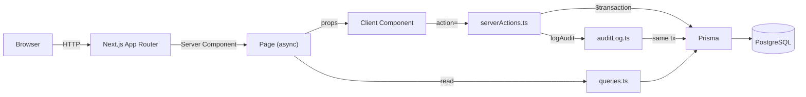

# HRManager

A production-grade HR management system with granular RBAC, audit logging, rate limiting, security headers, AI-powered i18n across 18 languages, and 899 tests (865 unit/integration + 34 E2E) at 99.7% line coverage.

[](https://github.com/MikkoNumminen/HRManager/actions/workflows/ci.yml)


### **[Try the live demo](https://hr-manager-pearl.vercel.app)** — click "Try Demo" to sign in instantly, no account required.

<p align="center">
  
</p>
<p align="center">
  
  
</p>

---

## Highlights

- **899 tests (865 unit/integration + 34 E2E), 99.7% line coverage** — Zod schemas, RBAC logic, auth callbacks, Prisma queries, server actions, rate limiting, audit logging, all 42 UI components tested against real PostgreSQL, plus Playwright E2E covering full user flows
- **Granular RBAC** — 4 roles, 23 permission keys, per-user grant/deny overrides with three-state toggles (deny / role default / grant), and "kick out" user removal with confirmation dialog
- **Immutable audit trail** — every mutation logged with before/after JSON snapshots inside the same `$transaction` for atomicity
- **18 languages** — next-intl with cookie persistence, Accept-Language detection, and an AI-powered translation pipeline using parallel Claude Code agents
- **Gamified demo tour** — 8-step tutorial with DOM-aware navigation hints, spotlight overlays, confetti celebrations, and auto-detection of task completion
- **Snackbar notifications** — global success/error toasts via React context + MUI Snackbar; consistent feedback across all 15 form actions
- **Accessibility (WCAG)** — semantic landmarks, skip-to-content link, ARIA labels on dialogs and controls, `role="alert"` on all error messages, keyboard-navigable table rows, `scope="col"` on all table headers
- **6 visual themes** — CSS custom properties with FOUC-preventing inline script; instant switching without re-render
- **Security headers** — X-Frame-Options, HSTS, X-Content-Type-Options, Referrer-Policy, Permissions-Policy on all routes
- **Rate limiting** — PostgreSQL-based sliding window (30 req/min per user/IP per action) on all server actions; user-based for authenticated users, IP-based fallback; no external services required
- **Docker-ready** — `docker compose up` for a fully working local environment with PostgreSQL, auto-migration, and demo login

---

## Tech stack

| Layer      | Technology                                            |
| ---------- | ----------------------------------------------------- |
| Framework  | Next.js 16 (App Router, Server Components)            |
| UI         | React 19 + MUI v7                                     |
| Language   | TypeScript 5.9                                        |
| ORM        | Prisma 6 (`relationLoadStrategy: 'join'`)             |
| Database   | PostgreSQL (Vercel Postgres / Neon in production)     |
| Validation | Zod 4                                                 |
| Auth       | NextAuth v5 (JWT, Google + GitHub OAuth + demo login) |
| Testing    | Jest 30 + React Testing Library + Playwright E2E      |
| CI/CD      | GitHub Actions (lint, test, build on every push)      |

---

## Architecture

> Full diagrams (data model, request flow, RBAC resolution, server action lifecycle, auth flow) in [`docs/architecture.md`](docs/architecture.md).



- **Reads** in `queries.ts` — Zod-validated, no `"use server"`
- **Mutations** in `serverActions.ts` — always inside `$transaction`, always audit-logged
- **Types** in `schemas.ts` — Zod schemas with `z.infer` exports, used everywhere
- **Auth** in `auth.ts` — JWT strategy with permission-enriched tokens; automatic superuser bootstrapping; `permissionsVersion`-based stale permission detection
- **RBAC** in `permissions.ts` — resolution: superuser (all) → user override → role default
- **Forms** — React 19 `useActionState` with `action=` prop, no `onSubmit`; success/error feedback via global snackbar
- **Themes** — CSS custom properties injected before hydration; 6 palettes switchable at runtime
- **i18n** — 18 locale files synced against `en.json` via custom audit tooling

---

## RBAC

| Role          | Access                                           |
| ------------- | ------------------------------------------------ |
| Superuser     | All permissions (immutable)                      |
| Administrator | All CRUD + audit log (no admin UI or data reset) |
| User          | Read-only                                        |
| Guest         | Read-only (unauthenticated)                      |

Individual permissions can be overridden per-user — e.g. granting `person:create` to a user, or denying `team:delete` from an administrator.

---

## Testing

| Layer            | Tests   |
| ---------------- | ------- |
| Zod schemas      | 71      |
| Prisma queries   | 40      |
| Server actions   | 137     |
| Auth callbacks   | 25      |
| Audit logging    | 6       |
| Rate limiting    | 13      |
| RBAC logic       | 28      |
| UI components    | 545     |
| E2E (Playwright) | 34      |
| **Total**        | **899** |

```
Statements : 99.07%    Branches : 95.65%
Functions  : 99.15%    Lines    : 99.73%
```

Server-side tests run against a real PostgreSQL test database. Client-side tests cover all 42 components including permission toggles, audit log filtering, tutorial system, snackbar notifications, theme switching, and language selection. Playwright E2E tests run against a production build covering authentication, CRUD for all entities, admin/audit access, guest access control, theme/language persistence, and snackbar lifecycle.

---

## Developer tooling

```bash
npm run test:e2e        # Playwright E2E tests (builds & starts production server)
npm run test:e2e:ui     # Playwright interactive UI mode
npm run validate        # pre-commit gate: Prettier + ESLint + i18n audit + full test suite
npm run i18n:audit      # report missing, extra, and untranslated keys across all locales
npm run i18n:fix        # auto-fill missing keys with English fallback, remove extras
npm run i18n:translate  # auto-translate via Claude Haiku API (requires ANTHROPIC_API_KEY)
```

**AI translation pipeline** — the i18n sync agent (`scripts/i18n-sync.ts`) audits 17 locale files against `en.json`. Two translation paths: parallel Claude Code subagents during development (6 agents, 17 locales, ~80s) or headless Claude Haiku API for CI.

---

## Getting started

### Docker (recommended)

```bash
docker compose up             # starts PostgreSQL + app at localhost:3000
```

That's it. The container runs migrations automatically and the demo login works out of the box — no OAuth setup required. To add Google/GitHub OAuth, create a `.env` file with your credentials (see below).

### Manual setup

```bash
npm install                   # install dependencies
cp .env.example .env          # configure environment variables
npx auth secret               # generate AUTH_SECRET
createdb hrmanager_dev        # create PostgreSQL databases
createdb hrmanager_test
npx prisma migrate dev        # apply schema migrations
npm run dev                   # start dev server at localhost:3000
```

| Variable             | Description                  |
| -------------------- | ---------------------------- |
| `DATABASE_URL`       | PostgreSQL connection string |
| `AUTH_SECRET`        | NextAuth secret              |
| `AUTH_GOOGLE_ID`     | Google OAuth client ID       |
| `AUTH_GOOGLE_SECRET` | Google OAuth client secret   |
| `AUTH_GITHUB_ID`     | GitHub OAuth client ID       |
| `AUTH_GITHUB_SECRET` | GitHub OAuth client secret   |

---

## Deployment

Deployed on **Vercel** with **Vercel Postgres** (Neon). Build: `prisma generate && prisma migrate deploy && next build`. The first OAuth user is bootstrapped as superuser. A demo login lets visitors explore without setting up OAuth.

---

Commit style: [Conventional Commits](https://www.conventionalcommits.org/en/v1.0.0/)
