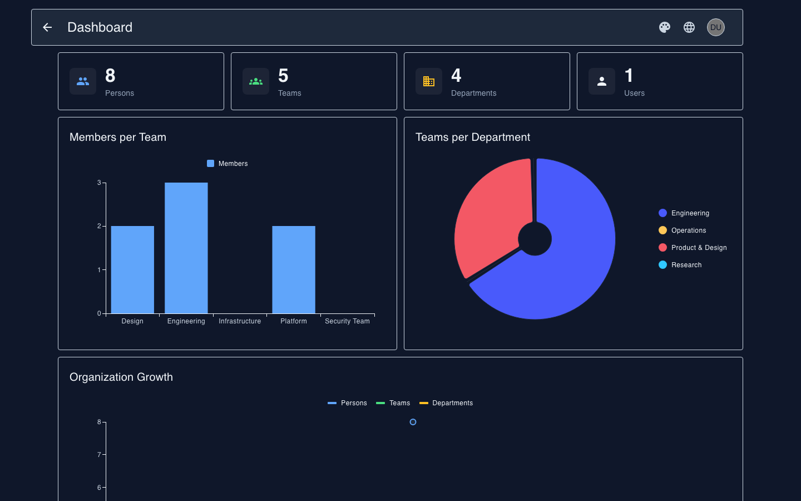
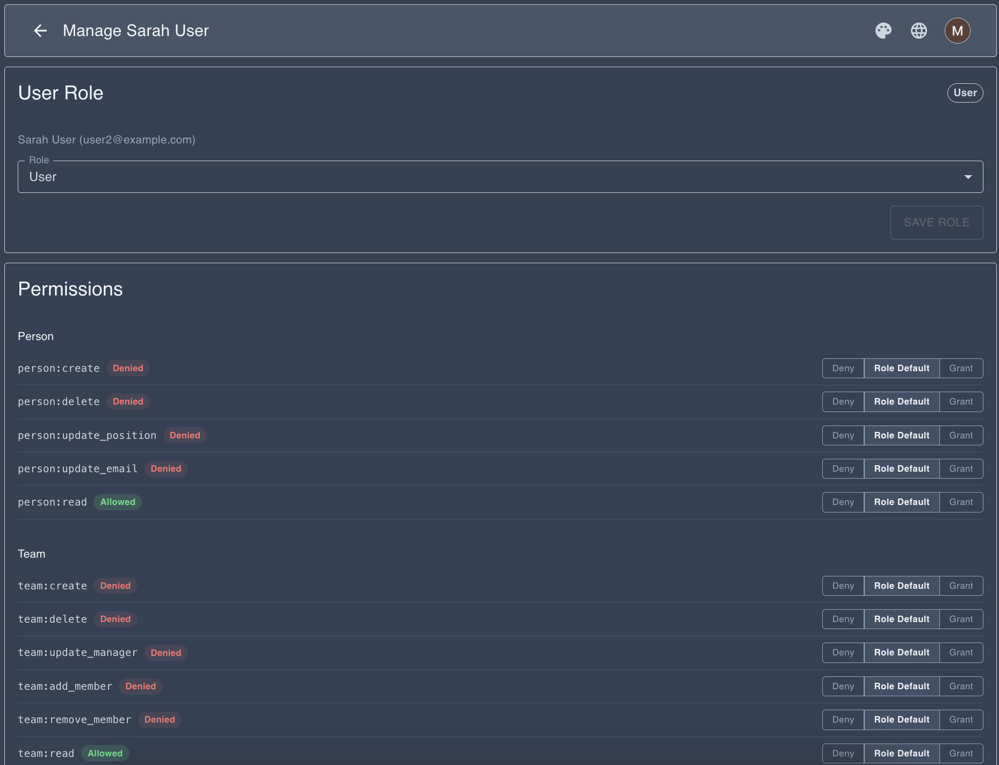
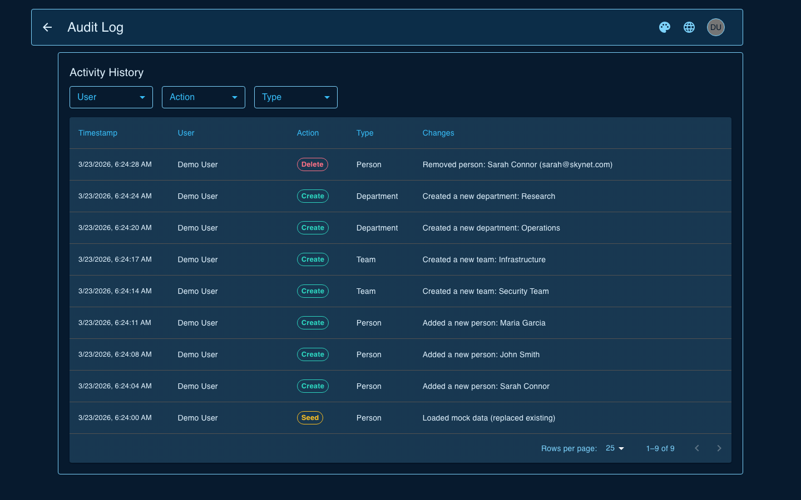
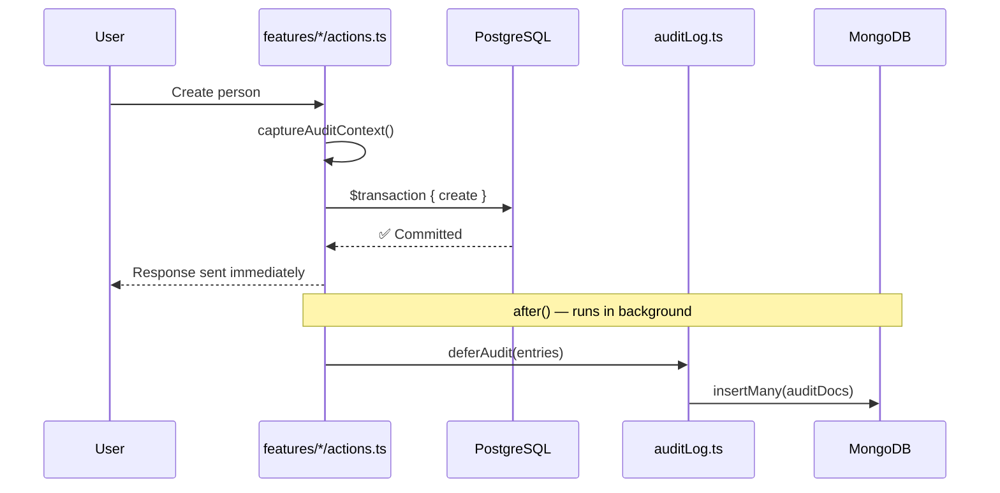
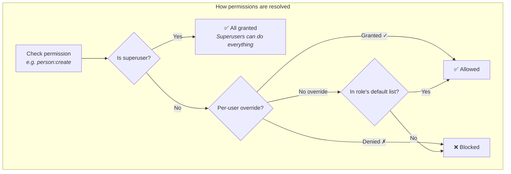
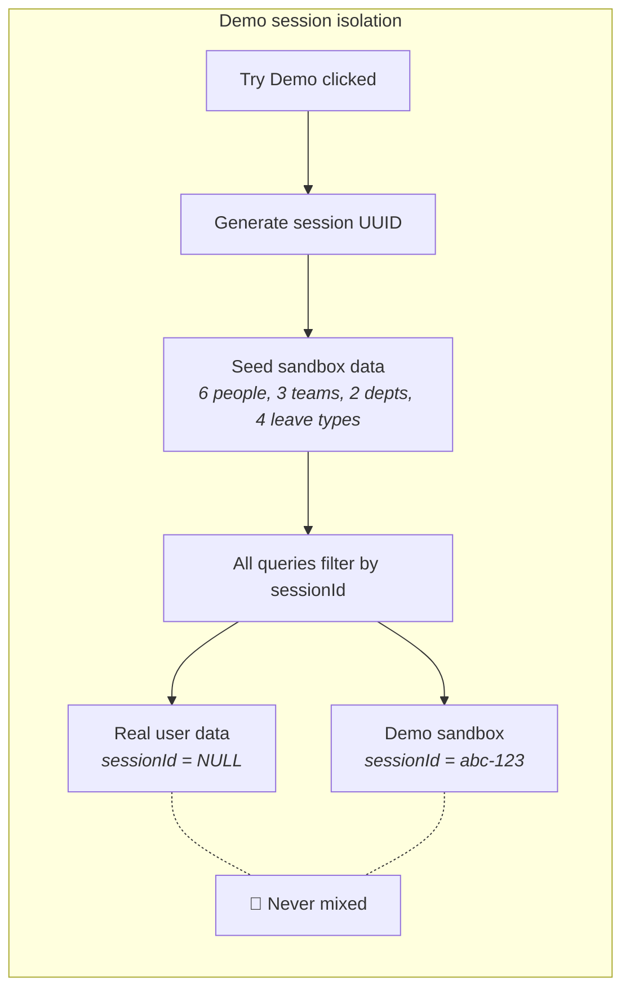
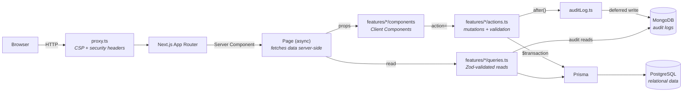

# HRManager

A full-stack HR management system built to production standards — not as a toy project, but as a showcase of real architectural decisions. Every technical choice has a reason. This README explains them.

[](https://github.com/MikkoNumminen/HRManager/actions/workflows/ci.yml)


### **[Try the live demo](https://hr-manager-pearl.vercel.app)** — click "Try Demo" to sign in instantly with your own isolated data sandbox, no account required.

<p align="center">
  
</p>
<p align="center">
  
  
</p>

---

## Highlights

### 🗄️ Data & persistence

- **Two databases, one app (polyglot persistence)** — PostgreSQL handles structured data (people, teams, permissions) because relational data needs ACID transactions and JOINs. MongoDB handles audit logs because they're append-only, variable-shape, and never updated — a document store is a natural fit. _Using one database for everything works, but choosing the right database for each workload is what production systems do._

- **Nothing is ever truly deleted (soft deletes)** — Records get a `deletedAt` timestamp instead of being removed. Partial unique indexes (`WHERE deletedAt IS NULL`) enforce uniqueness only on active records, so a deleted "John Smith" doesn't block creating a new one. Deleting a person cascades to their team memberships and nulls manager references. _Why? In HR systems, you need to answer "who was on this team last quarter?" years later. Hard deletes destroy that history._

- **Every change is recorded forever (immutable audit trail)** — Every mutation logs a before/after JSON snapshot to MongoDB. Writes are deferred via Next.js `after()` — the user gets their response immediately, logging happens in the background. Permission denials and rate limit hits are also logged as security events. A MongoDB TTL index on `createdAt` automatically purges documents older than 90 days — no cron job or manual cleanup needed. Each entry includes an HMAC-SHA256 hash linking it to the previous entry — an admin-only `/api/audit/verify` endpoint walks the chain and reports the first broken link if any entry was tampered with. _Why? Compliance requires a full history of who changed what, when, and why — and it shouldn't slow down the user to record it. The hash chain ensures logs can't be silently modified after the fact._

- **MongoDB schema validation** — The audit log collection enforces a `$jsonSchema` validator with required fields and BSON types. Invalid documents are warned in production (so schema evolution doesn't break writes) and rejected in development. _Why? Schemaless doesn't mean structureless — enforcing shape at the database level catches bugs that application-level validation misses._



### 🔐 Security & access control

- **38 permissions, not just 4 roles (granular RBAC)** — Instead of "admin = can do everything," each action has its own permission key (`person:create`, `team:delete`, `review:manage`, `leave:approve`, `position:manage`). Any permission can be overridden per-user: grant a regular user `person:create` without promoting them, or deny `team:delete` from an administrator who shouldn't have it. _Why? Simple role checks seem fine until you need exceptions — and every real organization has them._



- **Rate limiting without Redis** — A sliding-window algorithm built on PostgreSQL (30 req/min for actions, 10 req/min for auth). Uses atomic `INSERT...ON CONFLICT` so two simultaneous requests can't both sneak past the limit. A `/api/cron/cleanup` endpoint (protected by `CRON_SECRET`) prunes expired rate limit rows on a schedule — keeping the table from growing unbounded. _Why PostgreSQL instead of Redis? One fewer service to deploy, monitor, and pay for. The database you already have is powerful enough._

- **Security headers on every response (CSP)** — Each request gets a unique random nonce. Only scripts and styles tagged with that nonce can execute — even if an attacker injects HTML, the browser blocks it because the injected code doesn't have the secret nonce. Plus X-Frame-Options, X-Content-Type-Options, Referrer-Policy, and Permissions-Policy. _Why nonces? They're harder to bypass than domain allowlists and protect against inline script injection._

- **Two-Factor Authentication (TOTP)** — Optional TOTP-based 2FA using the `otpauth` library. QR code setup flow, 6-digit code verification on login, 10 one-time recovery codes (SHA-256 hashed), and admin reset. Secrets encrypted at rest with AES-256-GCM. A Next.js middleware redirects unverified 2FA users to the verification page. _Why TOTP over SMS? SMS is vulnerable to SIM swapping; TOTP is free, offline, and SOC 2 compliant._

- **Session management with concurrent limits** — Tracks active sessions per user with device/IP info. Max 5 concurrent sessions — oldest gets deactivated when exceeded. "Sign out all other sessions" in profile, admin force-logout per session or per user. JWT tokens carry a `sessionId` checked on every request — deactivated sessions force re-authentication. _Why server-side session tracking with JWTs? Pure JWTs can't be revoked. A lightweight session table gives you force-logout and concurrent limits without abandoning JWT benefits._

- **Demo users can't see real data (session isolation)** — Each "Try Demo" creates a private sandbox with a UUID. All database tables have a `sessionId` column — queries filter by it, so demo data and real data never mix. Sessions auto-expire after 24 hours. _This is a multi-tenancy pattern: hard data isolation without separate databases._



### ✨ User experience

- **Dashboard analytics** — KPI cards, bar charts, pie charts, line charts, and activity feed via MUI X Charts. Backed by 5 parallel PostgreSQL queries using CTEs and window functions — advanced SQL that computes complex aggregations in the database instead of fetching raw rows and looping in JavaScript. _Why raw SQL instead of the ORM? Prisma can't express CTEs or window functions, and these queries run much faster than the equivalent N+1 ORM approach._

- **Instant feedback (optimistic updates)** — When you create a person, they appear in the table immediately — before the server responds. React 19's `useOptimistic` shows the new item instantly, then reconciles when the server confirms. _Why? On slow connections, waiting 500ms+ for a table update feels broken. Optimistic UI makes the app feel instant._

- **Mobile-first responsive design** — Card layouts on mobile, tables on desktop, collapsible filters, stacking form buttons, hamburger navigation. All responsive tokens centralized in `muiStyles.ts`. _Why mobile-first? Building for small screens first ensures mobile never gets a degraded experience — you enhance for desktop, not patch for mobile._

- **6 visual themes** — Dark, Light, Cyberpunk, Retro Terminal, Bubblegum, and Ocean. CSS variables injected before the page renders (prevents the flash of wrong theme on load). Switching is instant with zero re-renders. _A small feature, but FOUC prevention and zero-rerender switching demonstrate attention to polish._

- **18 languages** — next-intl with cookie persistence and Accept-Language auto-detection. An AI translation pipeline audits 17 locale files and auto-translates missing keys via Claude API. _Why AI-powered? Manual translation doesn't scale. This pipeline translates 17 locales in ~80 seconds._

- **Gamified demo tour** — 8-step interactive tutorial with spotlight overlays, confetti, and auto-detection of task completion. Navigation hints are DOM-aware — they find the right element dynamically, so UI refactors don't break the tour.

- **Real-time updates (SSE / polling)** — Every mutation automatically broadcasts a real-time event to all connected clients via Server-Sent Events. Other users see live notifications when someone creates a person, approves leave, or modifies a team — without refreshing. Hybrid transport: SSE for persistent connections (self-hosted, dev), automatic fallback to 30-second polling on Vercel's free tier (10-second serverless timeout). The 30 s interval is a deliberate trade-off — at 5 s an idle demo tab burned 720 Lambda invocations/hour against the Hobby tier Active CPU budget. In-process EventEmitter with per-session ring buffer (100 events) — zero external dependencies, swappable to Redis pub-sub in one file. Self-notification filtering: you don't get notified about your own actions. Activity feed component shows recent events with action-specific icons and relative timestamps. Session-scoped: demo users only see events from their sandbox. _Why SSE over WebSocket? Next.js App Router doesn't support WebSocket upgrade in route handlers. SSE works natively with `ReadableStream` and degrades gracefully._

- **Snackbar notifications** — Global success/error toasts via React context across all 17 form actions. No silent failures, no mystery about what happened.

- **Keyboard shortcuts** — Press `?` to see all shortcuts. `/` focuses search, `g` then `d/p/t/e/l/r/o/a` navigates to any page (chord-based with 1s timeout). Suppressed inside inputs. _Why chords? Single-key shortcuts conflict with typing; a `g` prefix gives 8+ navigation targets without stealing keystrokes from forms._

- **Calendar export (iCal)** — `/api/calendar` exports approved leave requests as an RFC 5545 `.ics` file, importable into Google Calendar, Outlook, or Apple Calendar. Supports `?personId=` filtering. Zero external dependencies — generates the format directly. _Why no library? iCal is a simple text format; a 90-line generator is more maintainable than a dependency._

- **Accessibility (WCAG)** — Semantic landmarks, skip-to-content, ARIA labels, `role="alert"` on errors (screen readers announce immediately), keyboard-navigable tables, and info tooltips with `cursor: "help"`. Automated axe-core testing runs 25 WCAG AA checks across 22 components to catch violations early. _Built into every component from the start, not bolted on afterward._

- **Loading skeletons on every page (Suspense boundaries)** — Every route has a `loading.tsx` that renders a pixel-matched MUI Skeleton layout while the async server component fetches data. Next.js automatically wraps these in `<Suspense>` — the shell is streamed instantly and the real content replaces it once ready. _Why skeletons instead of spinners? Spinners tell you "loading"; skeletons show you where the content will land, reducing perceived latency._

- **Server-side pagination & search** — Every management table (persons, teams, departments) uses database-level `skip`/`take` (Prisma) so only one page of results loads at a time. Search is URL-driven (`?q=` + `?page=`) via a 400ms debounced `router.replace` — typing updates local state immediately, the server re-fetches after the debounce. Results are bookmarkable and shareable. _Why server-side? Client-side filtering doesn't scale; pushing skip/take into Prisma means 25 rows per page regardless of org size, and the URL approach means deep links and browser history work naturally._

- **Cascade delete impact warnings** — Before deleting a person, team, or department, the confirmation dialog shows exactly what references will break: managed teams that will lose their manager, departments that will lose their head, team memberships that will be removed, linked leave requests, and review assignments. Fetched server-side and displayed with a warning panel inside the ConfirmDialog. _Why? Accidental deletes in HR systems can cascade in ways users don't expect — showing the blast radius before confirmation prevents "I didn't know that would happen" moments._

- **Interactive organization chart** — Full-screen hierarchical visualization of the company structure: departments → teams → members, plus unassigned groups. Built with ReactFlow (`@xyflow/react`) and dagre auto-layout. Color-coded node types (departments in indigo, teams in sky blue, people in slate), summary chips showing counts, zoom/pan controls, and a minimap for navigation. Permission-gated with `person:read`. _Why ReactFlow over D3? First-class React integration, built-in zoom/pan/minimap, and custom node rendering without fighting the DOM._

- **Polished empty states** — Tables show a contextual icon, heading, and hint when empty. Persons shows a people icon with "Add your first person using the form above"; teams and departments follow the same pattern. Hint text is shown only when the user has create permission. Translated across all 18 locales.

### 📦 Data operations

- **CSV import/export** — Drag-and-drop CSV upload with client-side validation preview and RFC 4180 parsing (the official CSV standard). Export persons, teams, departments, and audit logs. Custom CSV parser with zero external dependencies. _Why no library? Full control over error handling, smaller bundle, and no third-party code in the data pipeline._

### 📋 Performance Reviews / 360 Feedback

- **Full 360-degree review system** — SELF, MANAGER, PEER, and DIRECT*REPORT review types. Configurable question templates with RATING (slider 1–10) and TEXT (free text) question types. Review cycles follow a DRAFT → OPEN → CLOSED lifecycle. \_Why a lifecycle? Drafts let HR build cycles before employees see them; closing locks in responses for archival accuracy.*

- **Configurable templates and cycles** — Administrators create reusable `ReviewTemplate` models, attach questions, then instantiate `ReviewCycle` runs that target specific employees. `ReviewRequest` tracks who owes whom a review; `ReviewSubmission` stores the answers. Four new Prisma models, 11 server actions, 3 permission keys (`review:view`, `review:manage`, `review:submit`), and 6 dedicated routes (`/reviews`, `/reviews/templates`, `/reviews/cycles/[id]`, `/reviews/my-reviews`, etc.). Full audit logging and demo session isolation applied throughout.

### 🏖️ Leave / Absence Management

- **Complete leave lifecycle** — Leave types (Annual, Sick, Parental, Unpaid — fully configurable), leave requests with approval workflow, and per-person balance tracking. Three new Prisma models (`LeaveType`, `LeaveRequest`, `LeaveBalance`), 7 server actions, 4 permission keys (`leave:view`, `leave:request`, `leave:approve`, `leave:manage_types`). _Why a full workflow? Real HR systems don't just track time off — they enforce balances, prevent overlapping requests, and require manager approval._

- **Balance enforcement and overlap detection** — Creating a leave request checks the employee's remaining balance and rejects if insufficient. Overlapping date ranges (pending or approved) are blocked at the transaction level. Approving a request automatically decrements the balance via upsert. _Why transactional? Two managers approving the same request simultaneously could double-debit the balance without transaction isolation._

- **Three-tab UI** — Requests (with status filtering, approve/reject/cancel actions), Types (CRUD with color picker), and Balances (allocation with remaining calculation and color-coded indicators). Permission-gated controls: only users with `leave:approve` see the approve/reject buttons; only `leave:manage_types` can configure types and allocate balances.

### 👤 Employee Self-Service Portal

- **Read-only employee view** — Authenticated users can access their own profile, team, manager, leave balance + request history, and performance reviews via `/employee`. All data is fetched server-side and scoped to the session — IDOR-safe by design (queries derive `personId` from the session email, never from caller-supplied IDs). Graceful "profile not linked" state when the auth email doesn't match a Person record. _Why read-only? GDPR and data-integrity reasons: employees should see their data, not unilaterally edit it — changes go through HR workflows with audit trails._

- **GDPR notice** — Profile page displays a GDPR-compliant notice informing the user what personal data is stored. _Why surface this? Transparency is a legal requirement under GDPR Art. 13/14, and it builds user trust._

### 📁 Position Catalog

- **Standardized job title catalog** — A dedicated `Position` model stores the organization's official position names. Administrators manage the catalog via `/positions` (add/delete entries). When HR updates a person's position field, the name is automatically synced into the catalog via an in-transaction `findFirst`+`create` — keeping it current without manual maintenance. The `UpdatePosition` form uses a `freeSolo` MUI Autocomplete: pick from the catalog or type anything. One new Prisma model, 2 server actions, 1 permission key (`position:manage`).

### 🧪 Quality

- **Advanced reporting & analytics** — 4 report types (headcount trends, turnover rates, leave utilization, review completion) powered by raw SQL CTEs and window functions. Tab-based UI with MUI X Charts (LineChart, BarChart, stacked BarChart), department and year filters, CSV export. Cached with `unstable_cache` (5-minute TTL). _Why raw SQL? These multi-table aggregations with running totals and partitioned window functions can't be expressed in Prisma's query builder._

- **Background job queue (pg-boss)** — PostgreSQL-based async processing with no Redis dependency. Cleanup worker prunes expired rate limits and stale demo sessions. Audit export worker generates CSV/JSON from MongoDB logs. Retry with exponential backoff, dead-letter queue, 24h archival. Admin dashboard shows queue status, failed jobs, and manual trigger buttons. _Why pg-boss over BullMQ? One fewer service to deploy — the database you already have is powerful enough for job queuing._

- **Custom feature flags** — Database-backed feature toggle system with 4-level resolution: environment variable override → user-specific override → global flag → default false. Two Prisma models (`FeatureFlag`, `UserFeatureFlag`), scoped as GLOBAL or USER. Admin UI for CRUD, per-user overrides, and global toggles. All changes audit-logged to MongoDB. _Why custom over LaunchDarkly? Zero external dependencies, full control, and the resolution logic itself is a portfolio talking point._

- **Sentry error tracking** — `@sentry/nextjs` captures unhandled exceptions, server action failures, and client-side errors. Separate `sentry.client/server/edge.config.ts` files initialize Sentry per runtime. A reusable `SentryErrorBoundary` component wraps MUI fallback UI; `global-error.tsx` catches render-level crashes; `captureServerActionError()` helper instruments server actions. Sentry is opt-in — the app runs normally without a DSN configured. _Why opt-in? This is a portfolio project — developers shouldn't need a Sentry account to run it locally._

- **2900+ tests (Jest + Playwright E2E), 92% line coverage** — Unit tests, integration tests against real PostgreSQL + in-memory MongoDB (no database mocks), and 75 Playwright E2E tests covering full user flows. _Why real databases in tests? Mocked tests can pass while production breaks. If your test doesn't hit a real database, it's not testing what you think it's testing._

- **Structured logging (Pino) with trace correlation** — JSON logs in production, human-readable in development. Every log line automatically includes OpenTelemetry `traceId` and `spanId` via Pino's mixin — search a trace ID in your log aggregator to see every log from that request. `createRequestLogger()` adds userId context on top. _Why Pino? It's the fastest Node.js logger, and structured JSON logs are parseable by Datadog, Grafana Loki, and CloudWatch without custom parsing rules._

- **OpenTelemetry tracing & metrics** — Full distributed tracing via `@opentelemetry/sdk-node`. PostgreSQL queries are auto-instrumented via `@opentelemetry/instrumentation-pg`. Every server action gets a span (`action.createPerson`, `action.approveLeaverequest`, etc.) with events for auth, rate-limit, and business logic phases. Custom metrics: `hrm.action.count`, `hrm.action.duration`, `hrm.db.query.duration`, `hrm.error.count`. Middleware injects `X-Trace-Id` and `Server-Timing` headers on every response. Exports to any OTLP-compatible backend (Jaeger, Grafana Tempo, Datadog). Opt-in via `OTEL_ENABLED=true`. _Why OpenTelemetry? It's the vendor-neutral standard — instrument once, export to any backend. Combined with Pino trace correlation, you get a complete picture: what happened (logs), how long it took (traces), and how often (metrics)._

- **Health check endpoints** — `/api/health` returns status, version, and uptime (shallow probe for load balancers). `/api/ready` checks PostgreSQL (`SELECT 1`) and MongoDB connectivity, returning 503 with per-dependency error details when degraded. _Why two endpoints? Health checks should be fast and cheap; readiness checks can be slow because they verify real dependencies._

- **Org-wide query caching** — A reusable `cache()` wrapper (`src/lib/cache.ts`) wraps `unstable_cache` from `next/cache` and is applied to the highest-traffic queries: the dashboard metrics + org chart, the analytics reports, and the four core org-wide listings (`getPersons`, `getTeams`, `getDepartments`, `getPositions`). All entries are keyed by `sessionId` (so demo users stay isolated) and tagged with `org-data` / `dashboard` / `org-chart`. Every mutating server action calls `updateTag("org-data")` (Next.js 16's read-your-own-writes API) so the same request that creates a person sees the new row immediately, while concurrent requests from other users see stale data for up to the 5-minute TTL. Test-safe — the wrapper short-circuits to a passthrough under `NODE_ENV=test`. _Why cache? The home page hits four org-wide queries on every load; caching turns ~80–200 ms of Prisma round-trips into a single ~1 ms in-memory lookup, which is the dominant CPU win on Vercel's serverless plan._

- **Vercel `ignoreCommand`** — A `vercel.json` at the repo root short-circuits Vercel deployments when only docs (`*.md`), tests (`src/tests/**`, `src/**/__tests__/**`, `e2e/**`), CI configs (`.github/**`, `.husky/**`), or jest/playwright/stryker config files change. The check lives in `scripts/vercel-ignore.sh` (Vercel caps `ignoreCommand` at 256 characters, so the long pathspec list can't live inline) and diffs against `$VERCEL_GIT_PREVIOUS_SHA` (the last deployed commit — correct for multi-commit pushes) with `:(exclude)` pathspecs, falling back to `HEAD^` and ultimately to "deploy" when no base is reachable. _Why? Each Vercel build runs `scripts/vercel-build.sh` (`prisma generate` → `next build`, plus `prisma migrate deploy` on production deploys only), which is the most CPU-expensive step in the entire pipeline. Skipping deploys for test-only or docs-only commits typically halves monthly build minutes on a portfolio repo with frequent README/TODO churn._

- **Per-request permission memoization** — `getCurrentUser()` and the no-arg `getUserPermissions()` are wrapped in React's `cache()`, which deduplicates identical calls within the same Server Component render. The home page calls `hasPermission()` ~5× (one per query) plus an explicit `getUserPermissions()` for the TopBar — without memoization that's 6 independent `prisma.user.findUnique` round-trips, each with a `permissions` join. After `cache()`, it collapses to a single DB hit per render. The `userId`-keyed variant intentionally stays unmemoized so admin pages can look up multiple users in one render. _Why? On the Vercel Hobby tier, every saved Prisma round-trip is also saved Active CPU — and this is the cheapest possible win because it's a one-line change._

- **Edge runtime for `/api/health`** — The shallow health probe has no Prisma / Node-only dependencies, so it runs on the Edge runtime instead of a Node Lambda. Edge invocations spin up much faster than serverless functions, so uptime monitors and load-balancer probes burn far less Active CPU. The matching proxy excludes `/api/health`, `/api/ready`, `/api/realtime/poll`, and `/api/realtime/sse` so those high-frequency endpoints don't pay for CSP nonce generation and security-header injection on every hit.

- **Performance at scale** — 40+ database indexes on foreign keys and frequently queried columns, N+1 query elimination (replaced eager-loaded relation counts with `_count` aggregations and `groupBy` batching), and `select` narrowing on all relation includes to avoid fetching unused columns. Performance seeding script generates 10k employees / 200 teams / 50 departments for load testing. Benchmark script measures all major query patterns with warm-up runs and P95 reporting. Full scaling analysis in [`SCALING.md`](SCALING.md) documents known scaling cliffs and recommendations for 100k+ employees. _Why document scaling limits? A production system should be honest about where it breaks — and have a plan for when it gets there._

- **Docker-ready** — `docker compose up` starts PostgreSQL + MongoDB + the app. Migrations run automatically, demo login works out of the box. _One command, zero setup, fully working._

---

## Tech stack

| Layer      | Technology                       | Why this choice                                                        |
| ---------- | -------------------------------- | ---------------------------------------------------------------------- |
| Framework  | Next.js 16 (App Router)          | Server Components for zero-waterfall data fetching                     |
| UI         | React 19 + MUI v7 + MUI X Charts | `useOptimistic` + `useActionState` eliminate form boilerplate          |
| Org Chart  | ReactFlow + dagre                | Interactive graph visualization with auto-layout                       |
| Language   | TypeScript 5.9                   | End-to-end type safety from database schema to UI props                |
| ORM        | Prisma 7                         | Type-safe queries + raw SQL escape hatch for complex analytics         |
| Databases  | PostgreSQL + MongoDB 8           | Relational data in SQL, append-only logs in a document store           |
| Validation | Zod 4                            | Runtime validation + TypeScript type inference from one schema         |
| Auth       | NextAuth v5 (JWT)                | Stateless auth that scales without session storage                     |
| Testing    | Jest 30 + Playwright             | Unit/integration against real DBs + E2E against production builds      |
| CI/CD      | GitHub Actions                   | Lint, format, type-check, error-code gate, test, build — on every push |
| Jobs       | pg-boss                          | PostgreSQL-based job queue — no Redis, retries, dead-letter queue      |
| Monitoring | Sentry + OpenTelemetry           | Error capture + distributed tracing + custom metrics; both opt-in      |

---

## Architecture

> Full diagrams (data model, request flow, RBAC resolution, server action lifecycle, auth flow) in [`docs/architecture.md`](docs/architecture.md).



**How data flows through the app:**

| What           | Where                   | How it works                                                                                               |
| -------------- | ----------------------- | ---------------------------------------------------------------------------------------------------------- |
| Reads          | `features/*/queries.ts` | Zod-validated, no `"use server"`. Dashboard uses raw SQL with CTEs for complex aggregations                |
| Mutations      | `features/*/actions.ts` | Always inside `$transaction` — even single operations, because consistency beats micro-optimization        |
| Audit logging  | `auditLog.ts` → MongoDB | Deferred via `after()` so it never slows down the user's response                                          |
| Real-time      | `eventBus.ts` → SSE     | Every `deferAudit()` call also emits to in-process EventEmitter; SSE streams to clients, poll fallback     |
| Types          | `features/*/schemas.ts` | Zod schemas → `z.infer` → TypeScript types. Feature-local schemas, barrel re-exported via `schemas/`       |
| Auth           | `auth.ts`               | JWT with permission-enriched tokens. `permissionsVersion` detects stale permissions without extra DB calls |
| RBAC           | `permissions.ts`        | Resolution order: superuser (all) → user override → role default                                           |
| Demo isolation | `demoSession.ts`        | `sessionId` column on all entities — `NULL` = real user, UUID = demo sandbox                               |
| Forms          | React 19                | `useActionState` with `action=` prop (no `onSubmit`); `useOptimistic` for instant create feedback          |
| Responsive     | `muiStyles.ts`          | Centralized tokens for breakpoints, spacing, typography — one file, all components                         |
| Themes         | `themeConfig.ts`        | CSS custom properties injected before hydration; 6 palettes switchable at runtime                          |
| i18n           | `messages/*.json`       | 18 locale files synced via AI translation pipeline                                                         |
| CSV            | `csvUtils.ts`           | RFC 4180 parser/generator with zero dependencies; permission-gated admin page                              |
| Logging        | `logger.ts` (Pino)      | Structured JSON in production, pretty in dev; OTEL traceId/spanId auto-injected via mixin                  |
| Tracing        | `telemetry.ts` (OTEL)   | Auto-instrumented pg queries; server action spans with auth/rateLimit/logic events; custom metrics         |
| Caching        | `cacheInvalidation.ts`  | Tag-based `unstable_cache` (5-min TTL) on org-wide queries; mutations call `updateTag` (Next 16)           |
| Hash chain     | `auditHashChain.ts`     | HMAC-SHA256 linking each audit entry to its predecessor; admin verification endpoint                       |

**Feature-based module structure** — each domain (persons, teams, departments, reviews, leave, admin, etc.) is a self-contained module under `src/features/` with its own schemas, queries, actions, components, and co-located tests. Shared infrastructure lives at the `src/` root (`auth.ts`, `permissions.ts`, `auditLog.ts`, `rateLimit.ts`), with supporting helpers in `src/lib/` (`auditOutbox.ts`, `cache.ts`, `actionUtils.ts`). This encapsulation means changes to one domain rarely touch other domains, reducing merge conflicts and making the codebase navigable at scale.

```
src/features/
├── persons/          # schemas, queries, actions, components, __tests__
├── teams/
├── departments/
├── reviews/
├── leave/
├── admin/            # user management, permissions, feature flags, audit
├── employee/         # employee portal views
├── dashboard/
├── reports/          # org chart, analytics
├── positions/
├── profile/
├── realtime/         # SSE/polling event bus, activity feed, connection indicator
├── sessions/
├── twoFactor/
├── data/             # CSV import/export
├── featureFlags/
└── jobs/             # background job queue
```

### 🧩 Platform integration

HRManager is designed as a standalone, independently deployable application — but its modular architecture makes it equally suited for embedding into larger ecosystems. It is integrated into a [Turborepo monorepo](https://github.com/MikkoNumminen/Platform) via git submodule, where it runs alongside other apps (e.g. a community web app) with zero code duplication. The feature-based module structure, server action isolation, granular RBAC, and audit logging carry over unchanged — no adapter layer needed.

---

## RBAC

| Role          | Access                           | Typical use case                                  |
| ------------- | -------------------------------- | ------------------------------------------------- |
| Superuser     | All 38 permissions (immutable)   | System admin — first OAuth user is auto-promoted  |
| Administrator | All CRUD + dashboard + audit log | Day-to-day management (no admin UI or data reset) |
| User          | Read-only                        | Regular employee viewing org data                 |
| Guest         | Read-only (unauthenticated)      | Public visitors browsing without login            |

**The key insight:** roles define defaults, but individual permissions can be overridden per-user. Want to give a User `person:create` without making them admin? Grant it. Want to block an Administrator from deleting teams? Deny it. Overrides always win — deny takes precedence over grant.

---

## Testing

<!-- test-table:generated:start -->

| Layer                                      | Tests                                | What it covers                                                                                                            |
| ------------------------------------------ | ------------------------------------ | ------------------------------------------------------------------------------------------------------------------------- |
| Feature component tests                    | 981                                  | Per-feature UI + actions: persons, teams, departments, admin, reviews, realtime, leave, employee, 2FA, dashboard, reports |
| Shared component tests                     | 105                                  | Reusable components shared across features: LeaveManager tabs (types, balances, requests)                                 |
| Shared suites (a11y, schemas, permissions) | 828                                  | Cross-cutting: axe-core WCAG AA, Zod schemas, RBAC permissions, i18n, themes, telemetry, tutorial, middleware             |
| Server integration                         | 896                                  | Real PostgreSQL + MongoDB — server actions, queries, auth, audit hash chain, rate limiting, health, sessions              |
| Jobs                                       | 21                                   | pg-boss queue setup, worker registration, and the serverless fetch-based drain                                            |
| E2E (Playwright)                           | 75                                   | Auth, CRUD, detail editing, dashboard, profile, data I/O, form validation, full workflow                                  |
| **Total**                                  | **2906** (2831 Jest + 75 Playwright) | **92.1% line coverage · 92.0% function coverage**                                                                         |

<!-- test-table:generated:end -->

```
Statements : 90.34%    Branches : 87.36%
Functions  : 91.97%    Lines    : 92.12%
```

**Testing philosophy:** Server-side tests run against **real PostgreSQL** and **in-memory MongoDB** — not mocks. If your test doesn't touch the real database, it's not catching the bugs that matter (wrong SQL, missing indexes, constraint violations). Client-side tests cover every UI component. Playwright E2E tests run against a production build.

---

## Developer tooling

```bash
npm run test:e2e        # Playwright E2E tests (builds & starts production server)
npm run test:e2e:ui     # Playwright interactive UI mode
npm run validate        # pre-commit gate: Prettier + ESLint + type-check + error-code gate + i18n audit + full test suite
npm run i18n:audit      # report missing, extra, and untranslated keys across all locales
npm run i18n:fix        # auto-fill missing keys with English fallback, remove extras
npm run i18n:translate  # auto-translate via Claude Haiku API (requires ANTHROPIC_API_KEY)
npx tsx scripts/perf-seed.ts       # seed 10k employees for performance testing
npx tsx scripts/perf-benchmark.ts  # benchmark all major queries with P95 reporting
```

---

## Autonomous agents

| Agent                | Trigger                     | What it does                                                                                    |
| -------------------- | --------------------------- | ----------------------------------------------------------------------------------------------- |
| **i18n translation** | `npm run i18n:translate`    | Audits 17 locale files against `en.json`, translates missing keys via Claude API                |
| **CI auto-fix**      | CI failure (`workflow_run`) | Triages failures, gathers sanitized logs, classifies error type, applies targeted fix, opens PR |

The **i18n translation agent** audits all locale files, identifies missing keys, and auto-translates via Claude API. Two modes: parallel agents during development (17 locales in ~80s) or headless API for CI.

The **CI auto-fix agent** (optional — requires paid API credits) runs a 6-stage pipeline on CI failures: transient detection → concurrent run guard → context gathering (sanitized logs + diff) → infrastructure bypass → targeted fix with restricted tools → PR for human review. Never auto-merges. Log sanitization redacts database URLs, API keys, and tokens before sending to the API.

---

## Getting started

### Docker (recommended)

```bash
docker compose up             # starts PostgreSQL + MongoDB + app at localhost:3000
```

That's it. Migrations run automatically, demo login works out of the box — no OAuth setup needed. To add Google/GitHub OAuth, create a `.env` file with your credentials (see below).

### Manual setup

```bash
npm install                   # install dependencies
cp .env.example .env          # configure environment variables
npx auth secret               # generate AUTH_SECRET
createdb hrmanager            # create PostgreSQL databases (matches .env.example)
createdb hrmanager_test
npx prisma migrate dev        # apply schema migrations
npm run dev                   # start dev server at localhost:3000
```

| Variable                             | Required | Description                                                                                                                                |
| ------------------------------------ | -------- | ------------------------------------------------------------------------------------------------------------------------------------------ |
| `DATABASE_URL`                       | Yes      | PostgreSQL connection string                                                                                                               |
| `MONGODB_URL`                        | Yes      | MongoDB connection string                                                                                                                  |
| `AUTH_SECRET`                        | Yes      | NextAuth secret (`npx auth secret` generates one)                                                                                          |
| `AUTH_GOOGLE_ID`                     | No       | Google OAuth client ID                                                                                                                     |
| `AUTH_GOOGLE_SECRET`                 | No       | Google OAuth client secret                                                                                                                 |
| `AUTH_GITHUB_ID`                     | No       | GitHub OAuth client ID                                                                                                                     |
| `AUTH_GITHUB_SECRET`                 | No       | GitHub OAuth client secret                                                                                                                 |
| `AUDIT_HMAC_SECRET`                  | Prod     | HMAC key for the audit-log hash chain. Required in production (the chain refuses to run with the built-in dev key); dev fallback otherwise |
| `ANTHROPIC_API_KEY`                  | No       | Claude API key (for i18n translation agent)                                                                                                |
| `OTEL_ENABLED`                       | No       | Set `true` to enable OpenTelemetry tracing + metrics                                                                                       |
| `OTEL_EXPORTER_OTLP_TRACES_ENDPOINT` | No       | OTLP trace collector URL (default: `http://localhost:4318/v1/traces`)                                                                      |
| `NEXT_PUBLIC_REALTIME_TRANSPORT`     | No       | `sse` or `poll` (auto-detected: SSE local, poll on Vercel)                                                                                 |

**Running the test suite locally** — server/integration tests run against a real PostgreSQL test database (`hrmanager_test`, created above) and an in-memory MongoDB, not mocks. They read `.env.test`, which is gitignored — create it from the template first:

```bash
cp .env.test.example .env.test   # point DATABASE_URL / DIRECT_URL at hrmanager_test
npm run test:all                 # pushes schema to the test DB, then runs every suite
```

If `.env.test` is missing, `npm run test:all` fails at the Prisma step — that missing file, not your change, is usually the cause. (Server tests share one DB; never run two suites at once.)

---

## Deployment

Deployed on **Vercel** with **Vercel Postgres** (Neon) and **MongoDB Atlas** (free tier). Build runs `scripts/vercel-build.sh`, which applies `prisma migrate deploy` **only on production** (so an unreviewed feature-branch migration can't hit the shared database from a preview build), then `prisma generate && next build`. The first OAuth user is auto-promoted to superuser. Demo login is opt-in — set `NEXT_PUBLIC_DEMO_LOGIN=true` to expose it.

### Kubernetes / Helm

Production-grade Kubernetes manifests and a Helm chart are provided in `k8s/`:

- **`k8s/manifests/`** — Namespace, Deployment (2 replicas, rolling update, resource limits, liveness/readiness probes on `/api/health`), Service, Ingress (NGINX, TLS, rate limiting 100 rps/IP), ConfigMap, Secret, HorizontalPodAutoscaler (2–10 replicas, CPU 70%), PodDisruptionBudget.
- **`k8s/helm/hrmanager/`** — Helm chart with parameterized templates, `_helpers.tpl`, and `NOTES.txt` post-install instructions. Supports `existingSecret` escape hatch for external secret managers.

```bash
# Raw manifests
kubectl apply -f k8s/manifests/

# Helm
helm install hrmanager k8s/helm/hrmanager/ --set image.tag=latest
```

See [`k8s/README.md`](k8s/README.md) for full setup including TLS, secrets, upgrade, and rollback instructions.

---

## Roadmap

_Last updated: March 2026_

### Features

- [ ] Email notifications — Resend/SendGrid for leave approvals, review requests, role changes + preferences page
- [ ] Leave balance carryover & accrual — year-end carryover logic, expiry dates, accrual schedules
- [ ] Tutorial UX overhaul — visual guidance with MUI highlighting/effects, improved back-button behavior
- [ ] Bulk actions on tables — multi-select persons/teams and apply batch operations
- [ ] Manager approval workflow & escalation — route leave requests to manager; auto-escalate after 5 days
- [ ] Full-text search — PostgreSQL tsvector across persons/teams/departments/reviews; ranked results
- [ ] Document management — upload/store employee contracts and certs; PDF preview; soft-delete
- [ ] Org chart drag-and-drop — drag person to new team/department with confirmation + audit trail
- [ ] Onboarding/offboarding workflows — checklists per employee; assign tasks to managers; track completion

### Architecture & Observability

- [x] OpenTelemetry tracing — instrument full request lifecycle; export to Jaeger/Datadog; P95/P99 dashboards
- [x] Real-time updates (SSE) — live notifications via Server-Sent Events with polling fallback for Vercel
- [x] Performance at scale — N+1 query fixes, 40+ database indexes, load testing tools, scaling analysis

### Security & Compliance

- [ ] Data encryption at rest — application-level encryption on sensitive fields; key rotation without downtime
- [ ] GDPR right-to-deletion — anonymize personal data after 7yr, retain audit logs 10yr, soft-delete recovery 30d

### Testing

- [ ] Visual regression testing (Chromatic) — snapshot all components in all 6 themes; diff on PRs
- [ ] Load & performance benchmarks (k6) — 100 concurrent users; performance budgets; CI enforcement
- [ ] Mutation testing (Stryker) — verify tests catch code mutations; target >80% mutation score

### DevOps & Infrastructure

- [ ] Blue-green deployment strategy — two production environments; zero-downtime upgrades + instant rollback
- [ ] Staging environment parity — staging with anonymized production data; E2E before prod

---

Commit style: [Conventional Commits](https://www.conventionalcommits.org/en/v1.0.0/)
