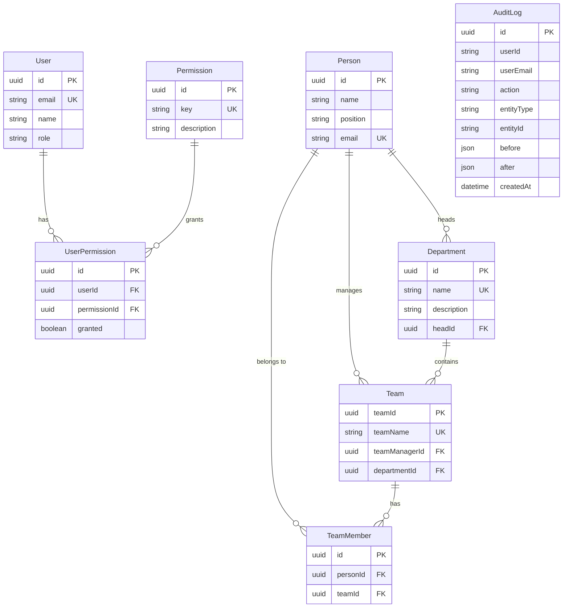
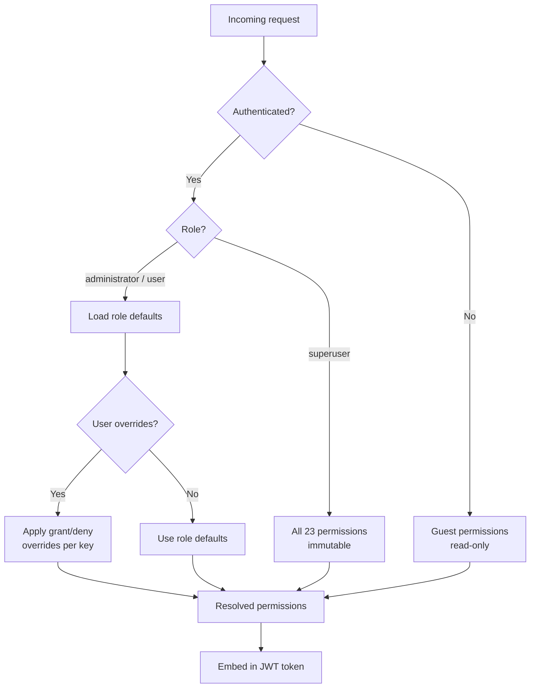
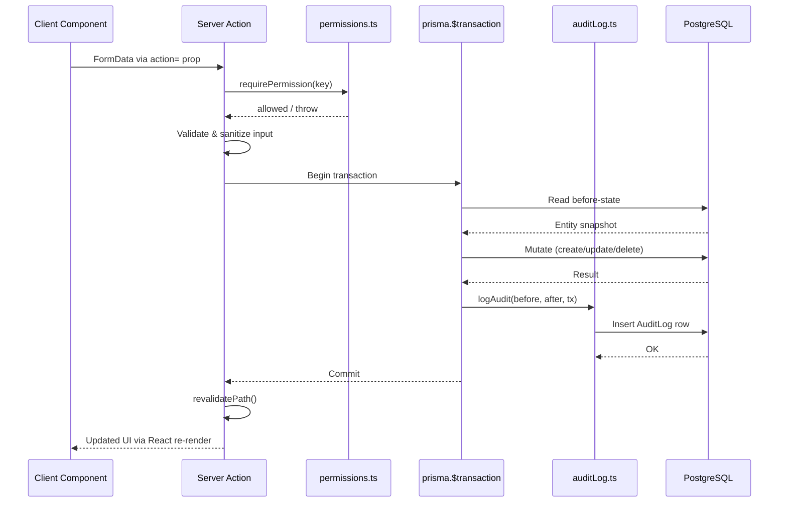
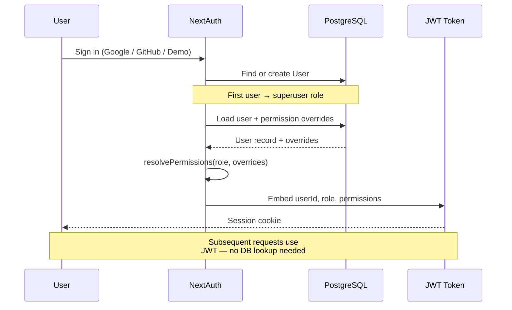

# Architecture

## Request flow

```mermaid
graph LR
    Browser -->|HTTP| Next["Next.js App Router"]
    Next -->|auth()| Auth["NextAuth v5<br/>(JWT)"]
    Next -->|Server Component| SC["Page (async)"]
    SC -->|read| Q["queries.ts<br/>Zod-validated"]
    SC -->|props| CC["Client Component<br/>(React 19)"]
    CC -->|action=| SA["serverActions.ts"]
    SA -->|requirePermission| RBAC["permissions.ts"]
    SA -->|$transaction| Prisma
    SA -->|logAudit| Audit["auditLog.ts"]
    Audit -->|same tx| Prisma
    Q --> Prisma
    Prisma --> PG[(PostgreSQL)]
```

## Data model



## RBAC resolution



## Server action lifecycle



## Auth flow


